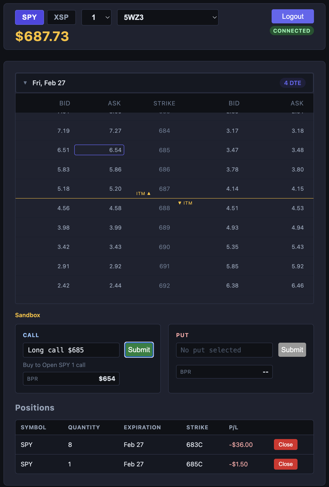

# QuickStrike
Allows you to trade SPY and XSP options using streamlined interfaces. No prompts. No complexity. Just fast trade executions. QuickStrike is a lightweight browser app for fast options execution. The application leverages a data abstraction layer, allowing more broker API to be integrated. The application features OAuth authentication, live quote streaming, option-chain selection, buying-power reduction estimates, and positions management. You can enter and exit any SPY or XSP option position without any prompts for confirmations. A trade can be opened and closed in mere seconds.

Currently supported trading plaform APIs are
- Interactive Brokers (Trader Workstation and IB Gateway)
- TastyTrade



## Features

- OAuth login with PKCE and direct IBKR connections
- Paper or live trading
- Option chain updates in real-time
- Fast call/put staging from option-chain by clicking on any bid/ask price
- One-click market order entry
- One-click to close open positions
- Open positions with real-time unrealized P/L

## Important safety note

- Start in paper mode first and verify behavior before enabling live trading.

## Using with Interactive Brokers
> You can use either Trader Workstation or IB Gateway. The start screen displays a lisst of prerequisites for required settings in IBKR. Pay close attention to these settings and configure your IBKR settings as noted.
>
> IBKR must be running and logged in before using this app.
>
> Market data subscriptions and a funded account are required.

## Using with TastyTrade

> The application supports the TastyTrade live trading environment and the sandbox environment. The sandbox environment allows you to use the app without submitting real orders. Each environment requires its own credentials. Put TastyTrade credentials in `config/adapters/tastytrade.config.js`.
>
>To create OAuth credentials for both Sandbox and Live environments, follow the official TastyTrade instructions:
>
>https://support.tastytrade.com/support/s/solutions/articles/43000700385
>
>**IMPORTANT**
>
>When setting up your TastyTrade OAuth app, you will see a setting called "Redirect URL". Use http://localhost:5500 for this.

## Command Line Statup

```bash
npm install
npm start
```

## Build installers for distribution

QuickStrike can be packaged as installable desktop apps (DMG/ZIP for macOS, NSIS installer for Windows, AppImage for Linux).

```bash
npm install
npm run build
```

Targeted builds:

```bash
npm run build -- mac --arm64
npm run build -- mac --x64
npm run build -- mac --universal
npm run build -- win
npm run build -- linux
```

Other useful options:

```bash
npm run build -- all
npm run build -- mac --dir
```

Build artifacts are written to `dist/`.

After successful installer builds, temporary/intermediate build artifacts in `dist/` are automatically cleaned up.

To keep all intermediate files, use:

```bash
npm run build -- mac --no-cleanup
```

### Release workflow (recommended)

1. Build installers on each target OS (or via CI matrix).
2. Upload artifacts from `dist/` to a GitHub Release.
3. Share the release page URL with users for download/install.

### Notes for production distribution

- macOS: use Apple Developer signing + notarization to avoid Gatekeeper warnings.
- Windows: use code signing to reduce SmartScreen warnings.
- Linux: AppImage usually runs unsigned, but signing is still recommended.

## Project structure

- `config.js` (root): shared runtime config (active adapter, environment)
- `config/adapters/` (root): adapter-specific config files
	- `ibkr.config.js`
	- `tastytrade.config.js`
- `index.html` (root): user interface
- `electron/` (root): Electron support
	- `ibkr-ipc.js` (root): IBKR service bridge using `@stoqey/ibkr`
	- `main.js` (root): Electron main process + local static server
	- `preload.js` (root): secure renderer bridge for Electron IPC
- `lib/*` (root): runtime files

## License

See `LICENSE`.
